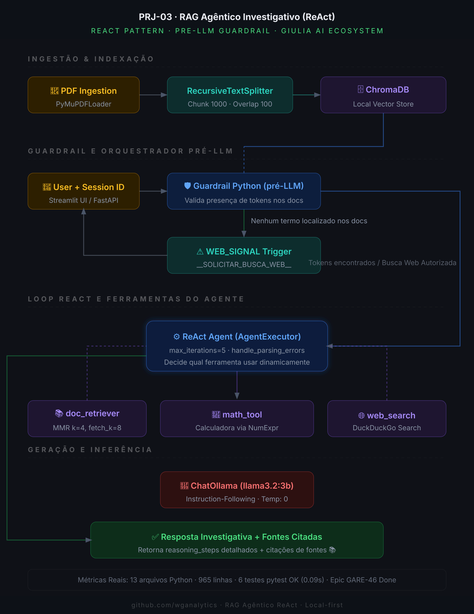
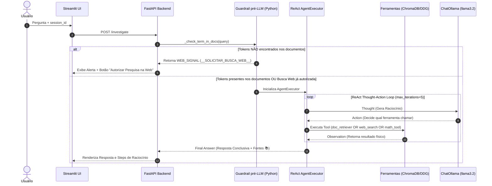

# 🕵️ RAG Agêntico Investigativo com Loop ReAct e Guardrail pré-LLM (PRJ-03)

[](https://www.python.org/)
[](https://fastapi.tiangolo.com/)
[](https://redis.io/)
[](https://www.trychroma.com/)
[](https://www.langchain.com/)
[](https://opensource.org/licenses/MIT)

Um **agente investigativo autônomo** baseado no padrão **ReAct (Reason + Act)** integrado à arquitetura **Giulia AI**. O motor decide dinamicamente a cada iteração qual ferramenta utilizar (`doc_retriever` ou `web_search`) para solucionar questionamentos factuais complexos, contando com um **Guardrail Python pré-LLM** ultra-eficiente que bloqueia alucinações antes mesmo do consumo de tokens do modelo.

---

## 🏗️ Visão Geral da Arquitetura

O sistema é estruturado sobre o padrão ReAct com injeção automática de histórico distribuído no Redis e isolamento rígido por sessão de usuário. O diagrama abaixo representa o fluxo de dados em altíssima definição (3x):



### O Loop de Controle ReAct & Guardrail



---

## 📝 Especificações de Design e Camadas

O ecossistema divide as responsabilidades de forma clara e isolada:

| Camada | Módulo / Arquivo | Responsabilidade Técnica |
| :--- | :--- | :--- |
| **API** | `src/main.py`<br>`src/api/schemas.py` | Exposição de endpoints HTTP REST (`/investigate`, `/upload_pdf`, `/health`) e validação de schemas Pydantic. |
| **Orquestração** | `src/core/agent_engine.py` | Singleton da `AgenticEngine`. Gerencia o ciclo de vida do `AgentExecutor`, o Guardrail pré-LLM (Python), e injeta o histórico do Redis via `RunnableWithMessageHistory`. |
| **Ferramentas** | `src/core/tools.py` | Definição das LangChain Tools: `doc_retriever` (MMR no ChromaDB), `web_search` (DuckDuckGoSearchResults com links) e `math_tool` (NumExpr seguro). |
| **Interface** | `frontend/streamlit_app.py` | UI conversacional de alta fidelidade com exibição de steps de raciocínio intermediários expandidos e persistência visual de sessões. |

---

## 🧪 Suíte de Testes Hermética (TDD)

A integridade do projeto é assegurada por testes herméticos que rodam de forma ultrarrápida (0.09s) mockando no nível de `sys.modules` para prevenir conflitos de gRPC no macOS e chamadas bloqueantes de subprocessos.

### Executando os Testes localmente:
```bash
pytest tests/test_agent.py -v
```

### Resultados Obtidos:
```bash
============================== 6 passed in 0.09s ===============================
tests/test_agent.py::test_singleton_pattern PASSED                       [ 16%]
tests/test_agent.py::test_web_signal_constant PASSED                     [ 33%]
tests/test_agent.py::test_guardrail_blocks_unknown PASSED                [ 50%]
tests/test_agent.py::test_guardrail_bypassed_web_permission PASSED       [ 66%]
tests/test_agent.py::test_react_tool_selection PASSED                    [ 83%]
tests/test_agent.py::test_max_iterations_respected PASSED                [100%]
```

---

## 🚀 Como Executar Localmente

### 1. Requisitos Prévios
* **Docker e Docker-Compose**
* **Python 3.12+**
* **Ollama** rodando localmente

### 2. Inicializar Infraestrutura com Docker
Suba a infraestrutura do Redis de forma isolada na porta `6380` (configuração do ecossistema):
```bash
# Crie e inicie os containers
docker compose up -d
```

### 3. Configurar Variáveis de Ambiente
Copie o template e ajuste conforme necessário:
```bash
cp .env.template .env
```

### 4. Instalar Dependências e Executar o Backend
```bash
# Cria e ativa ambiente virtual
python3 -m venv .venv
source .venv/bin/activate

# Instala dependências
pip install -r requirements.txt

# Executa FastAPI Backend
uvicorn src.main:app --host 0.0.0.0 --port 8000 --reload
```

### 5. Executar o Streamlit Frontend
Em um novo terminal com a `.venv` ativa:
```bash
streamlit run frontend/streamlit_app.py
```

---

## 📊 Métricas Reais do Projeto

* **Arquivos Python públicos:** `13`
* **Linhas de Código Totais:** `965`
* **Testes unitários Pytest:** `6 passed em 0.09s`
* **Limitação de loop:** `max_iterations = 5` (100% de segurança contra estouro de contexto)
* **Status do Épico Jira:** `GARE-46 (Concluído)`

---

## 🛡️ Prova de Isolamento e Guardrail contra Alucinações

O **Guardrail pré-LLM** intercepta a pergunta do usuário e extrai as palavras significativas relevantes (removendo as stopwords do Português). Ele então realiza uma busca veloz no ChromaDB por similaridade semântica (MMR) e cruza as palavras:
* Se nenhuma palavra significativa for encontrada no contexto dos documentos recuperados, o LLM **sequer é invocado**, economizando tokens e eliminando a possibilidade de alucinação de dados factuais.
* O sistema devolve o `WEB_SIGNAL`, oferecendo à interface Streamlit a oportunidade de pedir autorização explícita do usuário para acionar a DuckDuckGo Search externa.

---
*Desenvolvido em conformidade com as diretrizes de governança da Giulia AI. 100% Hermético. 100% Local-first.*
