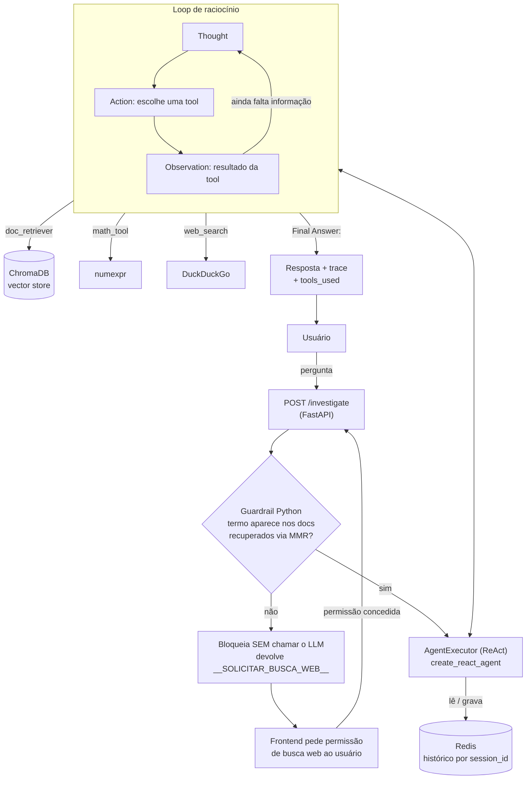

# PRJ-03 — Agentic RAG (Investigador Autônomo)

Terceiro projeto de uma progressão de oito técnicas de RAG (PRJ-01 a PRJ-08, orquestradas por um nono projeto de deploy): um agente que decide sozinho **quais ferramentas usar e quando parar**, em vez de seguir um pipeline fixo de recuperação e geração.

## Visão geral

Os dois primeiros projetos da série (RAG vanilla e RAG com memória) seguem um fluxo determinístico: recebe a pergunta, busca no banco vetorial, gera a resposta. O PRJ-03 introduz o padrão **ReAct** (Reasoning + Acting, Yao et al. 2022): o modelo de linguagem entra num loop de raciocínio explícito —

```
Thought: preciso decidir o que fazer
Action: nome da ferramenta
Action Input: argumento da ferramenta
Observation: resultado da ferramenta
```

repetido até que o próprio modelo decida que tem informação suficiente para responder. A diferença central em relação ao RAG tradicional é que a busca no vector store deixa de ser uma etapa obrigatória do pipeline e passa a ser **uma opção entre várias** que o agente escolhe, junto com calculadora e busca web — e ele pode encadear mais de uma, ou nenhuma, dependendo da pergunta.

Isso introduz um problema que os projetos anteriores não tinham: o agente pode alucinar uma resposta a partir de documentos que não contêm a informação pedida, ou entrar em loop tentando formatar uma ação que o modelo não sabe expressar direito. As duas seções de guardrail e de sensibilidade do prompt abaixo existem por causa disso.

## Funcionalidades

- **Loop ReAct real** via `langchain.agents.create_react_agent` + `AgentExecutor`, com prompt customizado e `max_iterations=5`.
- **Três ferramentas** que o agente escolhe autonomamente:
  - `doc_retriever` — busca por similaridade (MMR, `k=4`, `fetch_k=8`) no ChromaDB local.
  - `math_tool` — calculadora determinística via `numexpr` (sanitiza a expressão antes de avaliar).
  - `web_search` — busca no DuckDuckGo (`DuckDuckGoSearchResults`), usada **somente** com permissão explícita do usuário.
- **Guardrail em Python antes de qualquer chamada ao LLM**: verifica se algum token significativo da pergunta aparece literalmente nos trechos recuperados do vector store. Se não aparecer, a investigação é bloqueada ali mesmo — sem gastar uma chamada de LLM — e a resposta carrega um sinal interno (`__SOLICITAR_BUSCA_WEB__`) que o frontend traduz num pedido de permissão para buscar na web.
- **Contrato de sinal backend↔frontend**: o backend nunca decide sozinho ir para a internet. Ele devolve o sinal, o Streamlit renderiza um botão "Sim, pesquise" / "Não, apenas encerre", e só um clique explícito gera a pergunta reformulada que libera `web_search`.
- **Memória de sessão via Redis** (`RunnableWithMessageHistory` + `RedisChatMessageHistory`), por `session_id`.
- **Suporte multi-provider de LLM** (Ollama, Gemini, Grok, Groq) — ver seção própria abaixo.
- **Gestão de documentos**: upload de PDF (`PyMuPDFLoader` + `RecursiveCharacterTextSplitter`, chunks de 1000/100), listagem e remoção, tudo via API e refletido na sidebar do Streamlit.
- **Trace de raciocínio exposto na API e na UI**: cada resposta inclui a lista de passos (`thought`, `action`, `action_input`, `observation`) e a lista de ferramentas usadas.

## Arquitetura



O guardrail roda **antes** de instanciar qualquer chamada ao LLM: é um filtro em Python puro sobre o resultado da busca vetorial, não uma etapa do agente. Isso significa que uma pergunta claramente fora da base é rejeitada sem custo de token — o agente ReAct só é acionado depois que o guardrail confirma que há pelo menos um termo significativo da pergunta presente nos documentos recuperados.

## Stack tecnológica

| Componente          | Tecnologia                                              | Papel                                                            |
|----------------------|----------------------------------------------------------|-------------------------------------------------------------------|
| Orquestração do agente | LangChain (`create_react_agent`, `AgentExecutor`)      | Loop ReAct, parsing de Thought/Action/Observation, controle de iterações |
| LLM de raciocínio    | Ollama / Google Gemini / xAI Grok / Groq Cloud           | Motor plugável — ver seção multi-provider                        |
| Embeddings           | Ollama (`nomic-embed-text`, configurável)                 | Sempre local, independente do LLM de raciocínio                   |
| Vector store         | ChromaDB (persistido em disco)                            | Armazena e recupera os chunks dos PDFs indexados                  |
| Extração de PDF      | PyMuPDF (`PyMuPDFLoader`)                                  | Parsing de documentos, com página de origem preservada em metadado |
| Calculadora          | `numexpr`                                                  | Avaliação segura de expressões numéricas                          |
| Busca web            | `DuckDuckGoSearchResults` (langchain-community)            | Ferramenta condicionada a permissão explícita                     |
| Memória de sessão    | Redis (`RedisChatMessageHistory`, `RunnableWithMessageHistory`) | Histórico de conversa por `session_id`                       |
| API                  | FastAPI + Uvicorn                                          | Endpoint `/investigate` e gestão de documentos                    |
| Frontend             | Streamlit                                                  | Chat com renderização passo a passo do raciocínio do agente       |
| Testes               | pytest                                                     | 59 testes cobrindo agente, fábrica de LLM e diagnóstico de providers |

## Suporte multi-provider de LLM

O LLM de raciocínio é plugável entre quatro providers, resolvidos por `src/core/llm_factory.py` — o único módulo do projeto que sabe instanciar cada SDK concreto. Os **embeddings continuam sempre locais no Ollama**, em qualquer configuração: trocar o modelo de embedding invalidaria o ChromaDB já indexado, obrigando a reprocessar todos os PDFs. Só o LLM de raciocínio é intercambiável.

| Provider | Classe (LangChain)        | Variável de chave | Custo     |
|----------|----------------------------|--------------------|-----------|
| `ollama` | `ChatOllama` (local)       | —                  | zero      |
| `gemini` | `ChatGoogleGenerativeAI`   | `GEMINI_API_KEY` (ou `GOOGLE_API_KEY`) | por token |
| `grok`   | `ChatXAI` (xAI)            | `XAI_API_KEY`      | por token |
| `groq`   | `ChatGroq` (Groq Cloud)    | `GROQ_API_KEY`     | por token |

> **`grok` ≠ `groq`.** xAI Grok e Groq Cloud são empresas diferentes, separadas por uma letra no nome. Cada uma tem SDK e chave de API próprios — `GROQ_API_KEY` **não** habilita o Grok, e há teste automatizado (`test_grok_e_groq_nao_se_misturam`, `test_chave_do_groq_nao_habilita_o_grok`) travando essa confusão.

### Como trocar de motor

**Pelo `.env`** (padrão do sistema quando nenhum provider é informado na requisição):

```bash
LLM_PROVIDER=groq
GROQ_API_KEY=sua-chave
GROQ_MODEL_NAME=llama-3.3-70b-versatile
```

**Pela API**, por requisição — `provider` e `model` são opcionais em `InvestigateRequest`:

```bash
curl -X POST localhost:8002/investigate -H "Content-Type: application/json" \
  -d '{"question":"...","session_id":"s1","provider":"groq"}'

curl "localhost:8002/providers"              # estado de configuração de todos os providers
curl "localhost:8002/providers?probe=true"   # faz uma chamada real a cada um
```

Omitir `provider` usa o padrão do `.env`. Um provider desconhecido devolve **400** (`LLMConfigError`).

**Pela interface**: a barra lateral do Streamlit testa os motores ao abrir (`?probe=true`) e lista, por padrão, **apenas os que responderam** — um motor sem crédito ou com chave revogada não aparece na lista principal, e some para a legenda "Fora do seletor". A caixa "Mostrar motores indisponíveis" revela todos, e "🔄 Testar motores de novo" refaz o teste. A escolha de provider/modelo viaja junto de cada pergunta, e a resposta traz no rodapé qual motor a produziu.

Cada combinação `(provider, model)` tem seu próprio `AgenticEngine`, criado sob demanda e cacheado num dicionário de instâncias — montar o agente ReAct (prompt, tools, `AgentExecutor`) é caro o bastante para não refazer a cada requisição, e trocar de provider não descarta o motor anterior: ele continua disponível se o usuário voltar a escolhê-lo.

### Diagnóstico: configurado ≠ verificado

Ter o SDK instalado e a chave presente no `.env` **não** significa que o provider responde de verdade. A conta pode estar sem crédito, a chave pode ter sido revogada, o modelo pode não existir para aquele plano. Por isso `ProviderStatus` distingue dois eixos independentes:

- `available` — a *configuração* está completa (SDK importável + chave presente).
- `verified` — `None` nunca testado, `True` respondeu a uma chamada real, `False` falhou.

| Ícone (UI) | Significado |
|---|---|
| ⛔ | Configuração incompleta, ou falhou numa chamada real |
| ⚙️ | Configurado, mas ninguém provou que responde |
| ✅ | Respondeu a uma chamada real |

O módulo também classifica a causa da falha (`classificar_falha`) em categorias acionáveis — sem crédito, chave inválida, limite de taxa, modelo inexistente, rede — a partir de assinaturas de texto na exceção, com ordem de prioridade deliberada: um 429 do Gemini (`resource_exhausted`) é checado antes de "sem crédito" porque o Google devolve o mesmo texto de billing para um simples limite por minuto do free tier; e "sem crédito" é checado antes de "chave inválida" porque a xAI devolve falta de crédito como `403 permission-denied`, indistinguível textualmente de uma chave revogada. Falhas de infraestrutura (Redis fora do ar, erro no ChromaDB) são explicitamente **não atribuídas** ao provider — `falha_e_do_provider()` percorre a cadeia de causas da exceção para não reportar "provider falhou" quando o problema é um container caído.

### A lição: o prompt ReAct é sensível ao modelo

Testando o Groq de verdade nesta sessão, apareceu um bug real: o `llama-3.3-70b-versatile` recuperava o documento certo, mas em vez de emitir `Final Answer:` escrevia `Action: None` — uma ação vazia que o `AgentExecutor` não sabe interpretar, e ficava tentando de novo até estourar `max_iterations=5` (loop, resposta genérica de erro). O prompt ReAct padrão nunca proibia explicitamente uma ação vazia; funcionava com Ollama por sorte de comportamento do modelo, não por garantia do prompt.

A correção foi adicionar regras explícitas ao `AGENT_SYSTEM_PROMPT` (`src/core/agent_engine.py`): proibir literalmente `Action: None`/`Action: nenhuma`, exigir que uma ação vazia vire `Final Answer:` na mesma resposta, e proibir repetir o mesmo `Thought` duas vezes seguidas. Como efeito colateral, o Ollama também ficou consideravelmente mais rápido (medido: 20,9s → 3,6s) por parar de desperdiçar iterações no mesmo bug de formato — o problema não era exclusivo do Groq, só ficava menos visível com o Ollama.

A lição de engenharia: **um prompt ReAct que funciona com um modelo não está testado até rodar com outro.** Modelos diferentes cumprem o mesmo contrato textual de formas diferentes, e a única forma de descobrir isso é testar com o provider de verdade — não em mock.

## Estrutura de pastas

```
PRJ-03_Agentic_RAG/
├── src/
│   ├── main.py                  # FastAPI: /investigate, /providers, /upload_pdf, /list_docs, /remove_doc
│   ├── api/
│   │   └── schemas.py           # Pydantic: InvestigateRequest/Response, ProviderStatus, ReasoningStep
│   └── core/
│       ├── agent_engine.py      # AgenticEngine: prompt ReAct, guardrail, loop, memória Redis
│       ├── llm_factory.py       # Fábrica multi-provider (ollama/gemini/grok/groq) + diagnóstico
│       └── tools.py             # doc_retriever, math_tool, web_search + gestão de documentos
├── frontend/
│   └── streamlit_app.py         # Chat com trace de raciocínio, seletor de provider, upload de PDF
├── scripts/
│   └── verify_llm.py            # Diagnóstico standalone dos providers (configuração e/ou chamada real)
├── tests/
│   ├── test_agent.py            # Loop ReAct, guardrail, singleton por (provider, model)
│   ├── test_llm_factory.py      # Resolução de provider/modelo/chave, isolamento grok↔groq
│   └── test_provider_health.py  # Classificação de falhas, atribuição de infra vs. provider
├── data/
│   ├── vector_db/                # Persistência do ChromaDB
│   └── uploads/                  # PDFs enviados via /upload_pdf
├── requirements.txt
└── .env                          # LLM_PROVIDER, chaves de API, REDIS_URL, EMBEDDING_MODEL_NAME (não versionado)
```

## Como rodar

### Local, standalone

```bash
pip install -r requirements.txt

# Redis para memória de sessão
docker run -d -p 6380:6379 --name redis-prj03 redis:7-alpine

# Ollama precisa estar rodando no host (localhost:11434) para embeddings,
# e para o provider ollama se for o LLM_PROVIDER escolhido.

python3 -m uvicorn src.main:app --port 8002        # API
python3 -m streamlit run frontend/streamlit_app.py  # UI, lê API_URL (default http://localhost:8002)
```

### Via Docker / PRJ-09

Este projeto também roda como parte da orquestração local do ecossistema RAG, definida em `dev/rag/PRJ-09_Deploy_Cloud/docker-compose.yml`:

```bash
cd ../PRJ-09_Deploy_Cloud
docker compose up -d prj-03-api prj-03-ui redis
```

Nesse modo: o Ollama roda no host e é alcançado via `host.docker.internal` (não sobe em container — evitar redownload de dezenas de GB de modelos); o código não é copiado para a imagem, a raiz do monorepo é montada em `/app`; a API fica em `localhost:8003` e a UI em `localhost:8503`; o `REDIS_URL` é sobrescrito para `redis://redis:6379` (rede interna do compose) em vez do `localhost:6380` usado no modo standalone.

## Referência da API

| Método | Endpoint | Descrição |
|---|---|---|
| `GET` | `/` | Health check — status do engine, provider/modelo ativo, ferramentas carregadas |
| `GET` | `/providers?probe={bool}` | Estado de todos os providers. Sem `probe`, só configuração (rápido); com `probe=true`, chamada real a cada um |
| `POST` | `/investigate` | Envia a pergunta ao agente. Body: `question`, `session_id`, `provider` (opcional), `model` (opcional) |
| `POST` | `/upload_pdf` | Upload de um PDF, processado e indexado no ChromaDB |
| `GET` | `/list_docs` | Lista os nomes dos documentos já indexados |
| `DELETE` | `/remove_doc?filename=` | Remove um documento do índice e do disco |

A resposta de `/investigate` (`InvestigateResponse`) inclui `answer`, `provider`, `model`, `reasoning_steps` (lista de `thought`/`action`/`action_input`/`observation`) e `tools_used`.

## Testes

```bash
python3 -m pytest tests/ -q
```

59 testes passando, cobrindo três frentes: o loop ReAct e o guardrail (`test_agent.py` — singleton por combinação provider+modelo, bloqueio de termo ausente, seleção de ferramenta, respeito a `max_iterations`), a fábrica de LLM (`test_llm_factory.py` — resolução de provider/modelo/chave, isolamento explícito entre Grok e Groq) e o diagnóstico de saúde dos providers (`test_provider_health.py` — classificação de categorias de falha, não atribuição de erros de infraestrutura ao provider, comportamento do probe do Ollama sem carregar o modelo).

## Limitações conhecidas / decisões de engenharia

- **O guardrail é léxico, não semântico.** Ele verifica se um token da pergunta aparece literalmente no texto recuperado — não entende sinônimos nem paráfrases. Isso é uma escolha deliberada de custo: rodar antes do LLM significa que não pode depender do LLM para julgar relevância, senão perderia a própria razão de existir (evitar gastar uma chamada).
- **Permissão de busca web por frase, não por estado estruturado.** A detecção de "o usuário concedeu permissão" em `agent_engine.py` é uma lista de frases (`"sim"`, `"pode pesquisar"`, `"ok"`, etc.) checada como substring na pergunta — funciona para o fluxo guiado pela UI (que gera a frase automaticamente), mas é frágil a uma pergunta digitada livremente que comece com "sim" por outro motivo.
- **`max_iterations=5` é um limite fixo**, não adaptativo por complexidade da pergunta. Perguntas que legitimamente precisassem de mais de 5 ciclos de raciocínio seriam cortadas.
- **A extração de query em `doc_retriever` tenta ser robusta a qualquer formato que o LLM envie** (string, dict com `query`/`value`/`action_input`) porque providers diferentes já demonstraram, na prática, formatar `Action Input` de formas diferentes — outro sintoma da mesma sensibilidade a modelo descrita acima.
- **Prompt ReAct testado, mas não imune a novos modelos.** As regras adicionadas corrigem o padrão de falha observado no Groq; um provider ou modelo futuro pode expor um padrão diferente que o prompt atual não cobre. Não há validação sintática do output do LLM antes do parser do LangChain — o `handle_parsing_errors=True` absorve erros de formato, mas não previne loops de conteúdo semanticamente vazio.
- **Sem cache de resposta.** Duas perguntas idênticas na mesma sessão disparam o loop ReAct inteiro de novo; não há memoização por pergunta, só o histórico de conversa no Redis.
